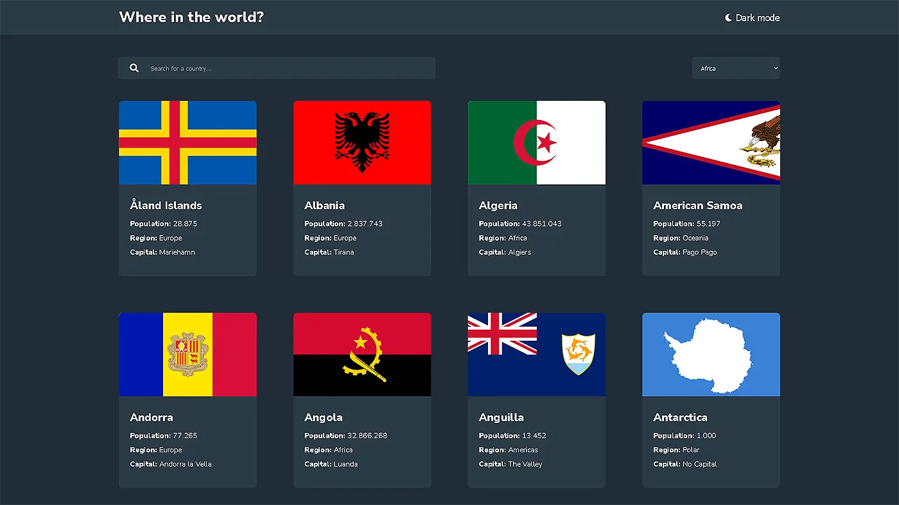
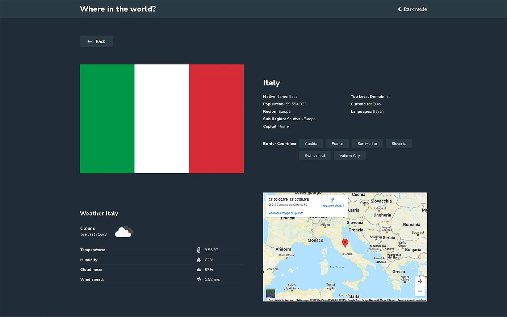

# React Countries & Weather API with color theme switcher

[](https://app.netlify.com/sites/travolgi-react-countries-weather-api/deploys)

This application gives some information about all countries in the world, such us country data, weather and map. 



## Table of contents

- [About App](#about-app)
- [Process](#process)
  - [Built with](#built-with)
  - [Useful resources](#useful-resources)
- [Getting Started](#getting-started)
  - [System Requirements](#system-requirements)
  - [Installation](#installation)
  - [Bugs](#bugs)
  - [Contributing](#contributing)

## About App

This application gives some information about all countries in the world:

- See all countries from the API on the homepage
- Search for a country using an `input` field
- Filter countries by region
- Click on a country to see more detailed information on a separate page
- Click through to the border countries on the detail page
- Toggle the color scheme between light and dark mode
- See current country weather data on detail page through API
  
- See the Map of the country on the details page
- Button scroll to top after the scrool
- Button for query reset when typing on the search input
- Error page with animated svg when no results found
  
- LocalStorage save of the set light or dark mode theme 

## Process

### Built with

- Semantic HTML5 markup
- CSS custom properties
- Flexbox
- Css Grid
- Mobile-first workflow
- [React](https://reactjs.org/) - JS library
- [React Router](https://reactrouter.com/) - For routes
- [Styled Components](https://styled-components.com/) - For styles
- [React Spinners](https://www.npmjs.com/package/react-spinners)

### Useful resources

- [React Router](https://reactrouter.com/docs/en/v6) - Docs
- [Styled Components](https://styled-components.com/docs) - Docs
- [REST Countries API](https://restcountries.com) - Docs
- [OpenWeather API](https://openweathermap.org/api) - Docs

## Getting Started

In order to view this project locally, you need to make sure you clone this repository and install it's dependencies.

### System Requirements

- [git][https://git-scm.com/] 2.34 or greater
- [node][https://nodejs.org/en/] 17.5 or greater
- [npm][https://nodejs.org/en/] 8.3.0 or greater

To check which versions you have installed you can run these commands:
```
git --version
node --version
npm --version
```
If requirements above are not installed in your computer, you'll need to install them. By clicking on them you can go to their website, which can lead you the way.

### Installation

- Clone the repository
  ```sh
  git clone https://github.com/travolgi/react-countries-weather-api.git
  ```
- Navigate to repository folder
  ```sh
  cd react-countries-weather-api
  ```
- Install npm packages
  ```sh
  npm install
  ```
- To run the app in the development mode run in the project directory: 
  ```sh
  npm start
  ```

### Bugs

Please feel free to create an issue if you see a bug or something unexpected in the app.

### Contributing

- Fork the Project
- Create your Feature Branch (`git checkout -b feature/yourFeature`)
- Commit your Changes (`git commit -m 'Brief explanation of feature`')
- Push to the Branch (`git push origin feature/yourFeature`)
- Open a Pull Request
